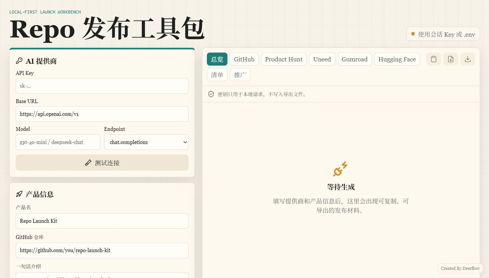

# Repo Launch Kit / Repo 发布工具包



Repo Launch Kit is a local-first AI tool that turns a GitHub repo or product idea into bilingual launch and sales materials.

Repo Launch Kit 是一个本地运行的 AI 发布工具包，帮助独立开发者把 GitHub 项目或产品想法快速整理成中英文发布材料和售卖文案。

## What You Get / 你会得到什么

- GitHub README draft / GitHub README 草稿
- Product Hunt launch copy / Product Hunt 发布文案
- Uneed launch copy / Uneed 发布文案
- Gumroad, Ko-fi, Afdian, and MBD sales copy / Gumroad、Ko-fi、爱发电、面包多销售页文案
- Hugging Face demo description / Hugging Face Demo 简介
- Launch checklist / 发布前检查清单
- Email and social media posts / 邮件和社交媒体宣传文案
- Markdown export / Markdown 导出
- ZIP export / ZIP 导出

## Who It Is For / 适合谁

- Indie developers shipping a small product
- AI tool builders who need launch copy
- First-time digital product sellers
- Makers who want to turn a GitHub repo into a product page

- 正在发布小产品的独立开发者
- 需要发布文案的 AI 工具制作者
- 第一次卖数字产品的人
- 想把 GitHub 项目包装成产品页的人

## Why Local-First / 为什么本地优先

Your API key stays on your own machine.

你的 API Key 保存在你自己的电脑上。

The app runs with a local Node server. It does not upload your API key to my server, does not store it in browser localStorage, and does not include it in exported files.

工具通过本地 Node 服务运行。它不会把你的 API Key 上传到我的服务器，不会放进浏览器 localStorage，也不会写进导出文件。

## AI Provider Support / AI 提供商支持

Repo Launch Kit uses OpenAI-compatible Chat Completions by default:

```text
{Base URL}/chat/completions
```

You can use any provider that supports the OpenAI-style `/chat/completions` endpoint.

只要你的 AI 服务兼容 OpenAI 风格的 `/chat/completions` 接口，就可以尝试使用。

Provider fields:

```text
API Key
Base URL
Model
Endpoint Mode: chat.completions
```

Default example:

```text
Base URL: https://api.openai.com/v1
Model: gpt-4o-mini
Endpoint Mode: chat.completions
```

## Download / Support / 下载和支持

The paid download package is being prepared for creator-platform release.

付费下载包正在通过创作者平台上架中。

- GitHub repo: https://github.com/shmily-BLJ/repo-launch-kit
- Ko-fi: coming soon
- Afdian / 爱发电: verification in progress
- MBD / 面包多: verification in progress

Early-bird price plan:

```text
China platforms: 19 RMB
Overseas platforms: $9
```

## Local Setup / 本地运行

```bash
npm install
cp .env.example .env
npm run dev
```

Open:

```text
http://127.0.0.1:5173
```

For the built production version:

```bash
npm run build
npm start
```

Open:

```text
http://127.0.0.1:8787
```

## Example Input / 示例输入

```text
Product name: Repo Launch Kit
GitHub repo: https://github.com/shmily-BLJ/repo-launch-kit
One-liner: A local AI tool that turns a GitHub project into bilingual launch and sales copy.
Target users: Indie developers, AI tool builders, and first-time product sellers.
Problem: I can build a product, but I do not know how to write launch copy.
Price: 19 RMB / $9 early bird
Language: Bilingual English and Chinese
```

## Download Package Includes / 下载包包含

- Local web app / 本地网页工具
- Setup guide / 安装说明
- Example input / 示例输入
- Example output / 示例输出
- Bilingual launch checklist / 中英双语发布清单
- AI provider configuration notes / AI 提供商配置说明

## Tests / 测试

```bash
npm test
npm run build
```

## Roadmap / 路线图

- Provider presets for common OpenAI-compatible services
- Better JSON repair for less strict models
- More templates for Ko-fi, Afdian, MBD, Gumroad, Product Hunt, and Uneed
- Better one-click export package
- More example launch packages

